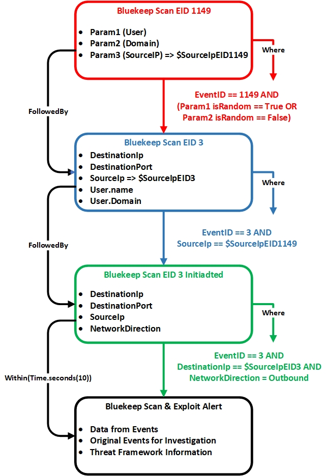

# Flink CEP : Bluekeep Detection Rule

This demo show how to use Apache Flink CEP library and Markov Chain to create a Bluekeep Scan and Exploit detection rule and generate an alert that will be sent to Elasticsearch.

# Documentation

Bluekeep Detection Rule is fully documented here: [Bluekeep Detection Rule GitBook documentation](https://botes.gitbook.io/botes-dataset/complex-event-processing-siem-detection-rules/cve-2019-0708-bluekeep)

Documentation provides details about installation and configuration of each components of the demo, information about the dataflow and the code itself.

# Pattern Sequence

